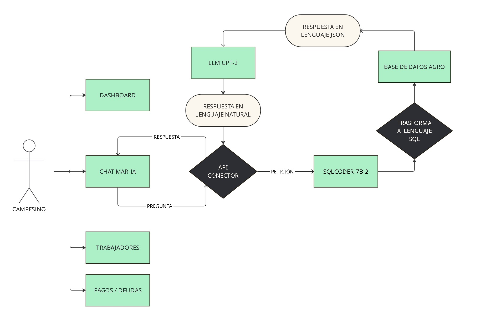

# MAR-IA CONSULTOR

**MAR-IA** is an intelligent chat system designed specifically for **agriculture-related queries**.

The system analyzes a farmer’s question and processes it through an **API** that selects the most appropriate response path. The connector routes the request to **SQLCoder-7B-2**, which queries the database and retrieves precise information when specific data—such as **statistics, prices, or crop details**—are required.

Responses are first structured in **JSON** and then rewritten into **clear, easy-to-understand language** so farmers can interpret them effortlessly.  
Additionally, the chat integrates with other tools such as **payment and debt monitoring**, **worker management**, and an **administrative dashboard**.

---

## Features
- Natural language understanding (**LLM-based**)
- Automatic SQL generation with **SQLCoder-7B-2**
- Human-readable responses (JSON → text)
- Integrations: **dashboard**, **payments/debts**, **worker management**

---

## Requirements
- **Python 3.10+**
- **PostgreSQL 13+**
- `pip` and `virtualenv` *(recommended)*

---

## System Overview

The diagram below shows a simplified end-to-end workflow:



📘 Example / allowed query types: [Questions](./pdf/questions.pdf)

---

## Quick Setup

```bash
# 1) Environment variables
cp .env.template .env    # edit values as needed

# 2) Virtual environment
python3 -m venv .venv
source .venv/bin/activate

# 3) Dependencies
pip install -r requirements.txt

# 4) Run the service
cd /workspace
/workspace/maria.sh start
/workspace/maria.sh stop
# or: uvicorn api.main:app --reload --port 8000
